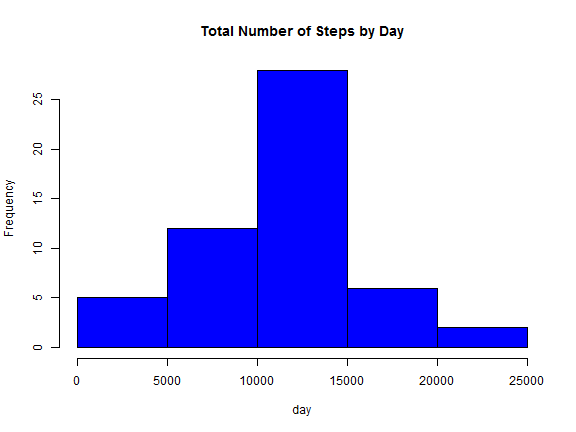
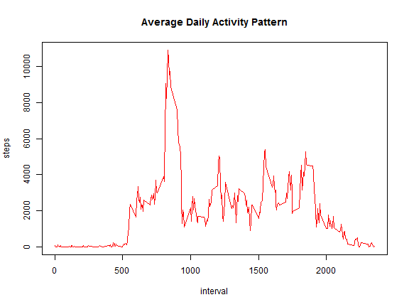
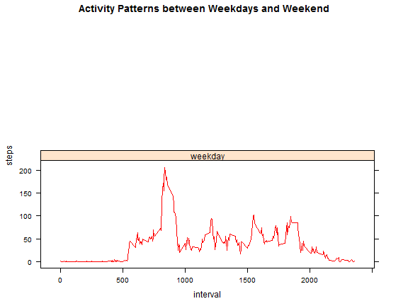

# Read data


```r
if(!file.exists("repdata-data-activity.zip")) {
  temp <- tempfile()
  download.file("https://d396qusza40orc.cloudfront.net/repdata%2Fdata%2Factivity.zip",temp)
  unzip(temp)
  unlink(temp)
}
```

```
## Warning in
## download.file("https://d396qusza40orc.cloudfront.net/repdata%2Fdata%2Factivity.zip",
## : downloaded length 53559 != reported length 53559
```

# See data


```r
activity <- read.csv("activity.csv")
head(activity)
```

```
##   steps       date interval
## 1    NA 2012-10-01        0
## 2    NA 2012-10-01        5
## 3    NA 2012-10-01       10
## 4    NA 2012-10-01       15
## 5    NA 2012-10-01       20
## 6    NA 2012-10-01       25
```

```r
names(activity)
```

```
## [1] "steps"    "date"     "interval"
```

# Transform data


```r
activity$date <- as.Date(activity$date, "%Y-%m-%d")
Totalsteps <- aggregate(steps ~ date, data=activity, sum, na.rm=TRUE)
head(Totalsteps)
```

```
##         date steps
## 1 2012-10-02   126
## 2 2012-10-03 11352
## 3 2012-10-04 12116
## 4 2012-10-05 13294
## 5 2012-10-06 15420
## 6 2012-10-07 11015
```

# Make a histogram of the total number of steps

 

# Mean and Median of steps taken per day: Calculate and report the mean and median of the total number of step


```r
mean(Totalsteps$steps)
```

```
## [1] 10766.19
```

```r
median(Totalsteps$steps)
```

```
## [1] 10765
```

# Average daily activity pattern


```r
steps_interval <- aggregate (steps~interval, data=activity, sum) 
```

 


```r
maximum_number_steps <- steps_interval[which.max(steps_interval$steps),1]
```

# Imputing missing values: Calculate and report the total number of missing values


```r
missing_values <- sum(is.na(activity$steps))
```

# Devise a strategy for filling in all of the missing values


```r
Fill_missing_values <- aggregate (steps~interval, data=activity, FUN=mean)
Fill_NA <- c(Fill_missing_values, steps~interval)
```

# Create a new dataset 


```r
dataset1 <- activity
dataset2 <- Fill_NA
```


# Make a histogram of the total number of steps taken each day and Calculate 


```r
Totalsteps <- aggregate(steps~date, data=dataset1, sum, na.rm=TRUE)
```

 


# Report the mean and median total number of steps taken per day


```r
mean (Totalsteps$steps)
```

```
## [1] 10766.19
```

```r
median(Totalsteps$steps)
```

```
## [1] 10765
```


# Differences in activity patterns between weekdays and weekends


```r
head(activity)
```

```
##   steps       date interval
## 1    NA 2012-10-01        0
## 2    NA 2012-10-01        5
## 3    NA 2012-10-01       10
## 4    NA 2012-10-01       15
## 5    NA 2012-10-01       20
## 6    NA 2012-10-01       25
```

```r
library(lattice)
activity$date<-as.Date(activity$date,format = '%Y-%m-%d')
activity$day <- ifelse(weekdays(activity$date) %in% c("Saturday", "Sunday"),'weekend','weekday')
head(activity$day)
```

```
## [1] "weekday" "weekday" "weekday" "weekday" "weekday" "weekday"
```

```r
stepsDaytype<-aggregate(steps~ interval+day,activity,FUN="mean")
head(stepsDaytype)
```

```
##   interval     day     steps
## 1        0 weekday 1.7169811
## 2        5 weekday 0.3396226
## 3       10 weekday 0.1320755
## 4       15 weekday 0.1509434
## 5       20 weekday 0.0754717
## 6       25 weekday 2.0943396
```

```r
names(stepsDaytype) <- c("interval", "daylevel", "steps")
```


 
